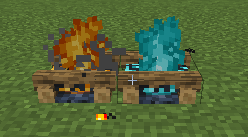
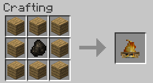
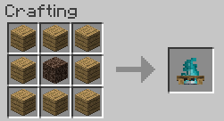

||| About
Hyper Lighting now includes 2 campfires based on the Minecraft variants. They can be used to provide light and also to cook food. Campfires come in two variants. A normal one which is not water proof and gets put out by rain/water and a Spongebob Campfire. This one is water proof and also works underwater.

Like most light sources in this mod, the campfires are lighted and extinguished by using the [Torch Lighter Tool](../items/lighter-tool.md) and support [Colored Lighting](../integrations.md)
|||

### Crafting
Both campfires are craftable making them survival friendly. Below are the crafting instructions for the different variants

||| Normal Campfire

To craft the normal campfire, you will need:

    8x Oak Wood Planks
    1x Charcoal

Place the oak wood planks around the crafting table and the charcoal in the middle (Or see the image above)
|||

||| Spongebob Campfire

To craft the Spongebob campfire, you will need:

    8x Oak Wood Planks
    1x Soul Sand

Place the oak wood planks around the crafting table and the soul sand in the middle (Or see the image above)
|||

!!!info
Campfires can be colored by right-clicking them with dye
!!!

!!!Note
When placed, campfires aren't lit by default and give off no light until you ignite it with the Lighter Tool (Configurable)
!!!
