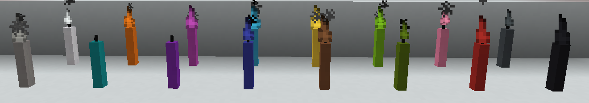
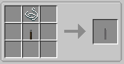

||| About
Candles are a new set of Lighting sources added by Hyper Lighting. The Candles also come in 16 colors. They can emit colored light by using Addon mods (see [Colored Lighting](../integrations.md) page in Help Center)

Candles can be ignited and extinguished with the [Torch Lighter Tool](../items/lighter-tool.md) (also added by this mod).
|||

### Crafting
All the Candles and variants are craftable making them survival friendly. Below are the crafting instructions for the different variants

||| General Crafting

To craft a candle, you will need:

    1x String
    1x Advanced torch of the color you want

Place the above ingredients in the middle row of your crafting table in the following order from the top: String, Torch (or see image above)

!!!info
Candles can be dyed by right-clicking them with Dye
!!!
|||

!!!Note
When placed, candles aren't lit by default and give off no light until you ignite it with the Torch Lighter Tool (Configurable)
!!!
