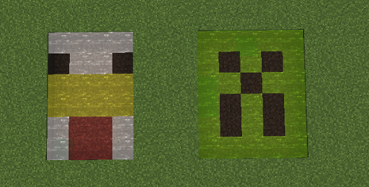
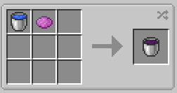
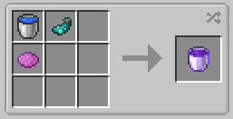

||| About [!badge Optifine/Sodium/Iris Compatible]
Colored water... Yes. Because blue water is boring. Unlike other colored water mods, Hyper Lighting colored water is actually useful!

Colored water can be used to grow crops, used in place of dye in some recipes, be used for drinking, sustain fish and other water mobs and colored GLOWING water can be used to grow crops in the dark.

In addition, glowing colored water gives off 3 minutes of night-vision when consumed, and you can also mix Colored Water to create unique design patterns
|||

!!! danger
On older versions of this mod, Optifine Render Regions stops the water from rendering in the world. Make sure you have them disabled, or you won't see the water
!!!

### Crafting
Yes, that sounds weird I know. So firstly, Colored Water generates in almost all biomes in "lakes" (unless disabled in the config). The water can be picked up in buckets, just like normal vanilla water.

But, if you are lazy like me and don't want to go out looking for colored water, you can simply "craft" your own using the recipes below.

||| Colored Water

To "craft" colored water, you will need:

    1x Bucket of Water
    1x Dye of your choice

Place the above ingredients in any order in the crafting grid.
|||

||| Glowing Colored Water

To "craft" glowing colored water, you will need:

    1x Bucket of Water
    1x Dye of your choice
    1x Glowing Ink Sac

Place the above ingredients in any order in the crafting grid.
|||

!!!info
You can also collect colored water in Glass Bottles, which can then be used as Dye in Light sources, in vanilla recipes, for drinking or to make more colored water.
!!!

!!!warning
Glowing Colored Water give 3 minutes of Night-Vision when consumed
!!!

---

||| Known Issues
* Colored water doesn't waterlog blocks
* When spawning fish in colored water with a bucket, the water block clicked on is replaced with vanilla water
* Colored water doesn't work in cauldrons and potions
|||
