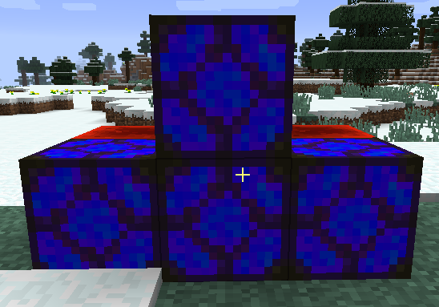
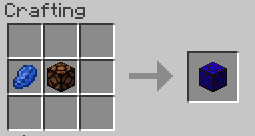

||| About
Dangerous Lamps do the opposite of Suspicious lamps. These give off light, but does not prevent mobs from spawing and has no effect on mob spawners
|||

### Crafting

||| Dangerous Lamp

To craft a dangerous lamp, you will need:

    1x Lapis Lazuli Dye
    1x Minecraft Redstone Lamp

Place the above ingredients in the middle row of your crafting table in the following order from the left: Lapis Lazuli Dye, Redstone Lamp (or see image above)
|||

!!!Note
Dangerous lamps require a redstone signal to work. You will see a texture change when the lamp is powered.
!!!
