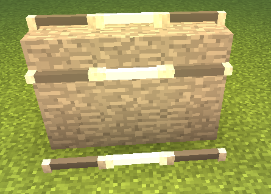
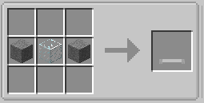

||| About
Fluorescent lights are a new style of lights in Hyper Lighting. These lights use power to work and supports colored lighting.

To power a Fluorescent light, you will need a [wireless battery module](../items/wireless-battery.md) linked to a solar panel. To install the module and or dye for color/[Colored Lighting](../integrations.md), CTRL Right-click on the light to open the GUI.
|||

### Crafting
Fluorescent Lights are craftable making them survival friendly. Below are the crafting instructions

||| Normal Crafting

To craft the Fluorescent Light, you will need:

    2x Stone Blocks
    1x Glass Block

Place the stone blocks in the middle right and left postions in  the crafting table and the glass block in the middle (Or see the image above)
|||

!!!Note
When placed, Fluorescent lights aren't lit by default and give off no light until you give it power and turn it on by right-clicking it.
!!!
