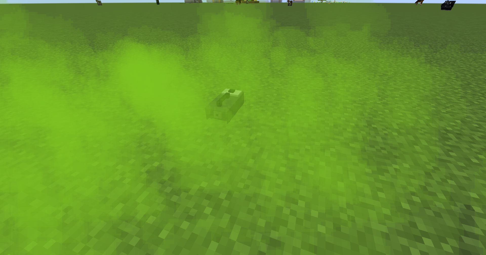
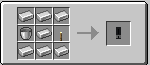

||| About
Whooooooo!!!!!! FOG MACHINES!!!!!!!!!! These babies give off thick amounts of smoke/fog. They can be remotely controlled, set to auto fire for creating spooky scenes and even have colored smoke!! You can change the fog color by right-clicking the fog machine and placing dye in the dye slot, or by using Colored Water
|||

### Crafting
Fog Machines are craftable making them survival friendly. Below are the crafting instructions

||| Normal Crafting

To craft a fog machine, you will need:

    1x Bucket
    7x Iron Ingots
    1x Torch

Place the above ingredients in the given order in the crafting grid.
|||

!!!info
Fog machines need water to work. Fill them by right-clicking them with a bucket of water or colored water.
!!!
