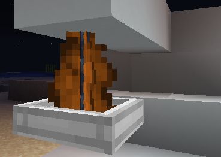
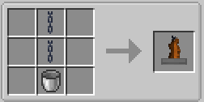

||| About
Hanging fires are kinda based on those Medieval fires that hang from the ceiling. They can be turned on and off with the Lighter tool and can be Dyed by righ clicking them with Dye
|||

### Crafting
Hanging fires are craftable making them survival friendly. Below are the crafting instructions

||| Normal Crafting

To craft a Hanging Fire, you will need:

    2x Chains
    1x Empty Bucket

Place the bucket in the middle bottom slot, and the two chains above that
|||

!!!Note
Hanging Fire Pits can be dyed by Right-Clicking them with dye
!!!
