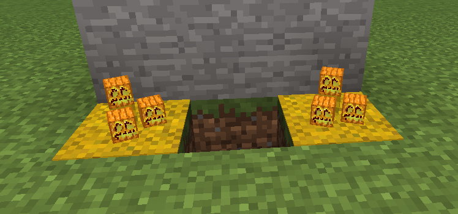
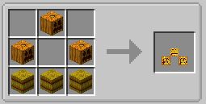
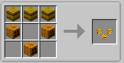

||| About
Jack O Lanterns are small, halloween themed lights. These mimic the classic crafted pumpkin lights used on halloween across most of the world

Like most light sources in this mod, the jack o lanterns are lighted and extinguished by using the [Torch Lighter Tool](../items/lighter-tool.md)
|||

### Crafting
Both Jack O Lanterns are craftable making them survival friendly. Below are the crafting instructions for the different variants

||| Normal Jack O Lantern

To craft the normal jack o lantern, you will need:

    3x Pumpkins
    3x Hay Bales

Place the pumpkins in the following order: 1 Middle Left, 1 Top Center, 1 Middle Right. Place the 3 hay bales at the bottom or see the image above.
|||

||| Inverted Jack O Lantern

To craft the Inverted Jack O Lantern, you will need:

    3x Pumpkins
    3x Hay Bales

Place the pumpkins in the following order: 1 Middle Left, 1 Bottom Center, 1 Middle Right. Place the hay bales at the top or see image above
|||

!!!Note
When placed, Jack o Lanterns aren't lit by default and give off no light until you ignite it with the Lighter Tool (Configurable
!!!
