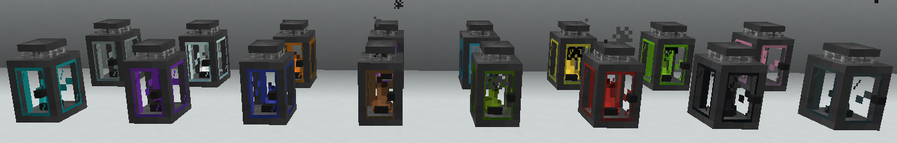
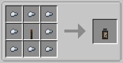
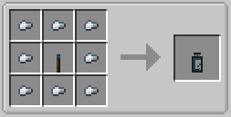

||| About
Advanced Lanterns are another type of light source added to Minecraft by Hyper Lighting. Like the Advanced Torches, they can also be extinguished and relighted/dyed, and also come in 16 different colors.

They are also lighted and extinguished using the [Torch Lighter Tool](../items/lighter-tool.md) and also support [Colored Lighting](../integrations.md).
|||

### Crafting
All the lanterns and variants are craftable making them survival friendly. Below are the crafting instructions for the different variants

||| Default Lantern

To craft the default lantern, you will need:

    8x Iron Nuggets
    1x Orange Advanced torch

Place the iron Nuggets around the crafting table, with the Orange Advanced torch in the middle (or see image above)
|||

||| Dyed Lantern

To craft a colored lantern, you will need:

    8x Iron Nuggets
    1x Advanced Torch of the color you want the lantern to be

Place the iron Nuggets around the crafting table, with the Advanced Torch in the middle (or see image above)

!!!info
You can also change the color of an existing lantern by Right-Clicking it with dye
!!!
|||

!!!Note
When placed, lanterns aren't lit by default and give off no light until you ignite it with the Torch Lighter Tool, unless changed in the config
!!!
