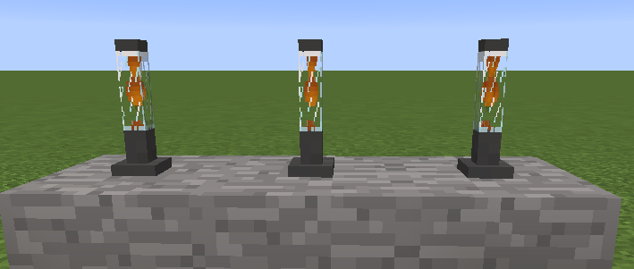
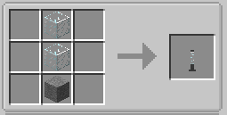

||| About
Lava lamps have made their way to Minecraft. These works of art light up a room with a display of moving fluid!
|||

### Crafting
Lava Lamps are craftable making them survival friendly. Below are the crafting instructions

||| Normal Crafting

To craft the Lava Lamp, you will need:

    2x Glass Blocks
    1x Stone

Place the glass blocks from the top center and place the stone in the bottom center block (or see the above image)
|||

!!!Note
Light lava lamps by right-clicking them. Side note, these may cause some lag due to the light animation. If it does, please report it!
!!!
