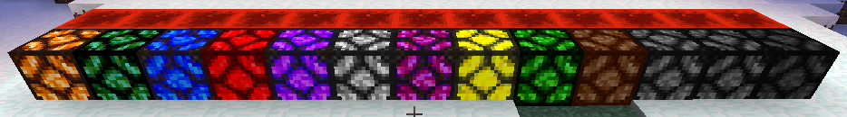
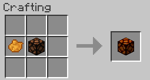
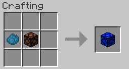

||| About
Colored Redstone are another type of light source added to Minecraft by Hyper Lighting. They are redstone controlled and therefore work just like the normal Minecraft Redstone lamps and also support [Colored Lighting](../integrations.md).
|||

### Crafting
All the Colored Redstone and variants are craftable making them survival friendly. Below are the crafting instructions for the different variants

||| Default Lamp

To craft the default colored redstone lamp, you will need:

    1x Orange Dye
    1x Redstone Lamp

Place the Orange dye on the left of the table, with the Redstone Lamp in the middle (or see image above)
|||

||| Dyed Lamp

To craft a colored lamp, you will need:

    1x Dye (See table below)
    1x Redstone Lamp

Place the dye on the left of the table, with the Redstone Lamp in the middle (or see image above)

!!!info
Redstone Lamps can be dyed by right-clicking them with Dye
!!!
|||

!!!Note
When placed, Colored Redstone give off no light until you apply a redstone signal to it
!!!
