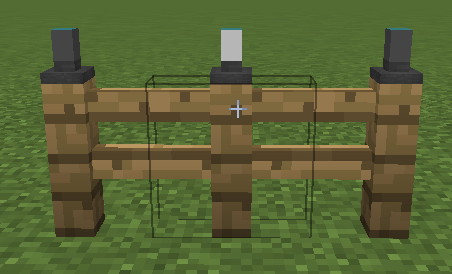
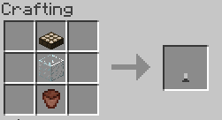

||| About
Solar fence lights are battery powered solar lights which can be turned on and off and can also be linked to a switch board. While primarily designed to be used on fences, they can be used almost anywhere, provided they have sun. They charge during the day and discharge at night if they are turned on. They can be turned on and off by right-clicking them.
|||

### Crafting

||| Solar Fence Light

To craft a solar fence light, you will need:

    1x Daylight Detector
    1x Glass Block
    1x Flower pot

Place the above ingredients in the middle row of your crafting table in the following order from the top: Daylight Detector, Glass, Flower Pot (or see image above)
|||

!!!Note
Solar fence lights require sun light to charge and are turned off by default.
!!!
