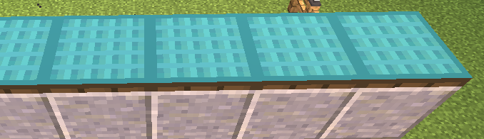
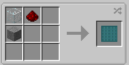

||| About
Solar Panels are intended to be used by Hyper Lighting blocks only and thus provides little support for other mods. Solar panels have built in batteries and can store up to 2k RF (or FE). Power can be extracted from them using [Wireless Battery Modules](../items/wireless-battery.md)
|||

### Crafting
Solar Panels are craftable making them survival friendly. Below are the crafting instructions

||| Normal Crafting

To craft the Solar Panel, you will need:

    1x Glass Block
    1x Redstone Dust
    1x Stone

Solar panels have shapeless recipes, so you can place the ingredients in any shape or form
|||
