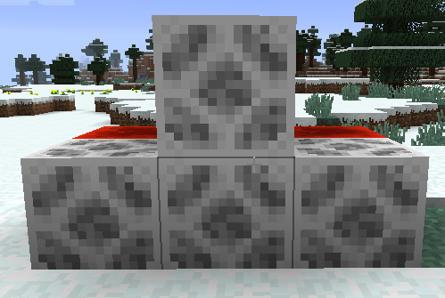
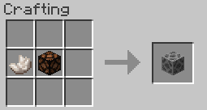

||| About
Suspicious Lamps are a type of redstone lamp which gives off no light, but can disable mob spawners and prevent low light mob spawning. These lamps do not support colored lighting and also have a nice little advancement when placing them.
|||

### Crafting

||| Suspicious Lamp

To craft a suspicious lamp, you will need:

    1x Nether Quartz
    1x Minecraft Redstone Lamp

Place the above ingredients in the middle row of your crafting table in the following order from the left: Nether Quartz, Redstone Lamp (or see image above)
|||

!!!Note
Suspicious lamps require a redstone signal to work. You will see a texture change when the lamp is powered.
!!!
