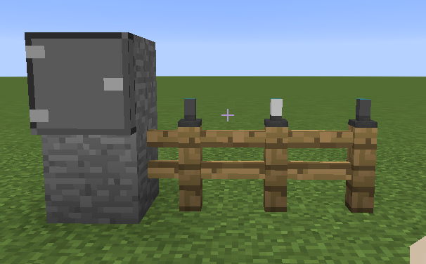
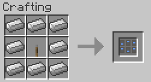

||| About
The Wireless Switch Box is a block that can control up to 6 Solar Fence lights. This box allows you to turn the lights on and off, see their battery level and charge state. To link a solar light to the box, you will need a [Wireless Switch Module](../items/switch-module.md).
|||

### Crafting

||| Switch Board

To craft a switch box, you will need:

    8x Iron Ingots
    1x Lever

Place the Iron Ingots on the outside of the crafting table and the lever in the middle (Or see above image)
|||

!!!Note
Switch Boxes don't do anything on their own, unless they are linked to a Light and Wireless Switch Module
!!!
