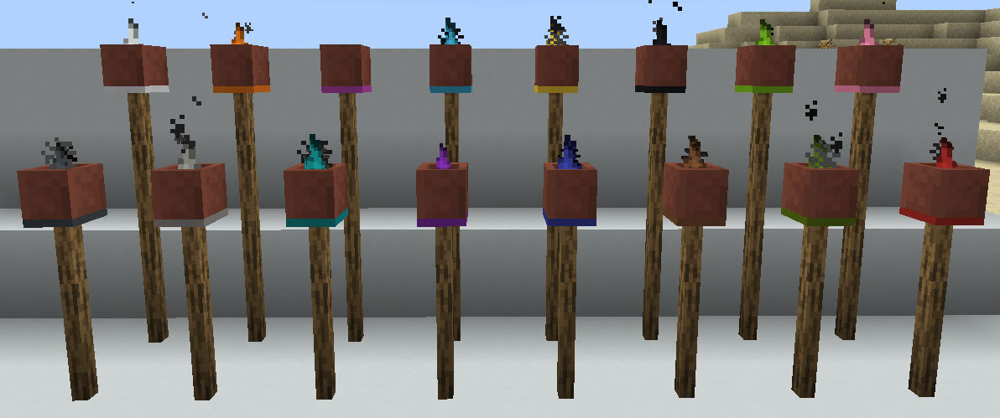
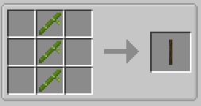
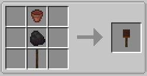
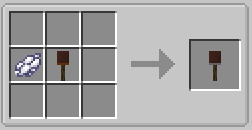

||| About
Tiki Torches are another type of light source added to Minecraft by Hyper Lighting. Like the Advanced Torches and Advanced Lanterns, they can also be extinguished and relighted/dyed, and also come in 16 different colors.

They are also lighted and extinguished using the [Torch Lighter Tool](../items/lighter-tool.md) and also support [Colored Lighting](../integrations.md).
|||

### Crafting
Tiki Torches can be built as high as you want by using Tiki Stickis (which are craftable as well). The crafting instructions below include the Tiki Sticki recipe as well.

||| Tiki Sticki

To craft a Tiki Sticki, you will need:

    3x Bamboo

Place the 3 Bamboo in the middle row of the crafting table starting from the top (or see image above). This will give you a Tiki Sticki
|||

||| Orange Tiki Torch

To craft an Orange Tiki Torch, you will need:

    1x Bucket (Empty)
    1x String
    1x Tiki Sticki

Place the ingredients in the middle row starting from the top: String, Bucket, Tiki Sticki (or see image above)
|||

||| Dyed Tiki Torch

To craft a colored tiki torch, you will need:

    1x Dye (See table below)
    1x Orange Tiki Torch

Place the above ingredients in the middle row of your crafting table in the following order from the left: Dye, Orange Tiki Torch (or see image above)
!!!info
Existing Tiki Torches can be recolored by right clicking them with dye
!!!
|||

!!!Note
When placed, tiki torches aren't lit by default and give off no light until you ignite it with the Torch Lighter Tool (Changeable in the config)
!!!
