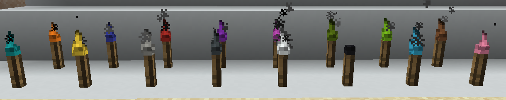
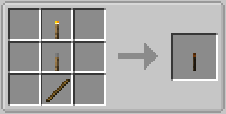
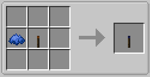

||| About
Advanced torches are a new set of Lighting sources added by Hyper Lighting. They look and act the same as the original Minecraft Torches, but they can be extinguished and re-ignited and dyed. The torches are available in 16 colors. They can emit colored light by using Addon Mods (See [Colored Lighting](../integrations.md) in Help Center).

Torches can be ignited and extinguished with the [Torch Lighter Tool](../items/lighter-tool.md) (also added by this mod).
|||

### Crafting
All the torches and variants are craftable making them survival friendly. Below are the crafting instructions for the different variants

||| Default Torch

To craft the default torch (also used as a base for crafting all the other variants), you will need:

    1x Stick
    1x Minecraft Default torch
    1x Lever

Place the above ingredients in the middle row of your crafting table in the following order from the top: Lever, Torch, Stick (or see image above)
|||

||| Dyed Torches

To craft a colored torch (also used as a base for crafting Lantern variants), you will need:

    1x Dye of your choice
    1x Advanced Torch (Orange)

Place the above ingredients in the middle row of your crafting table in the following order from the left: Dye, Advanced Torch (or see image above)

!!!info
You can also change the color of an existing torch by Right-Clicking it with dye
!!!
|||

!!!Note
When placed, torches aren't lit by default and give off no light until you ignite it with the Torch Lighter Tool (Unless you change it in the config)
!!!
