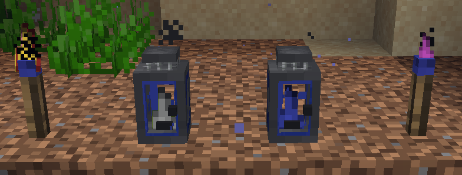
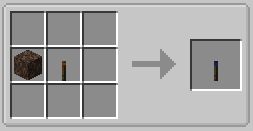
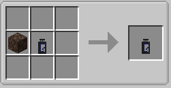

||| About
The Underwater torch and lantern are the demons of the Minecraft world. Not only do they have cool looking flames, these suckers also work underwater. Yes, you read that right. Both of these work underwater!

This torch and lantern are ~~lighted by default (because who has time to light a torch underwater)~~ When configured, but can also be extinguished just like the other torches and lanterns added by this mod by using the [Torch Lighter Tool](../items/lighter-tool.md).
|||

### Crafting
While crafting for the Underwater torch and lantern may not be the easiest thing to do, it is doable. Below are their instructions.

||| Underwater Torch

To craft an Underwater Torch, you will need:

    1x Block of Soul Sand
    1x Advanced Torch (Orange)

Place the Soul Sand in the middle left slot of the crafting table, with the Orange Torch in the middle slot (or see image above).
|||

||| Underwater Lantern

To craft an Underwater Lantern, you will need:

    1x Block of Soul Sand
    1x Advanced Lantern (Blue)

Place the Soul Sand in the middle left slot of the crafting table, with the Advanced Lantern in the middle slot (or see image above).
|||
