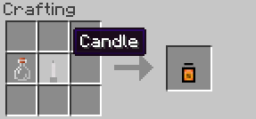

||| About
The Candle in a Jar is used to light the world around the player as they move about. Think of it as a flashlight. 

!!!warning
Due to RGBLib, Candle in a Jar is not available across all versions!
!!!
|||

### Crafting

||| Candle in a Jar

To craft a Candle in a Jar, you will need:

    1x Empty Glass Bottle
    1x Candle (Default)

Place the above ingredients in the middle row of your crafting table in the following order from the left: Glass Bottle, Candle (or see image above)
|||
