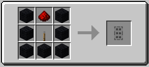

||| About
Fog machine remotes are used to trigger fog machines from a distance. Shift Right Click a fog machine to link the remote to it
|||

### Crafting

||| Fog Machine Remote

To craft a Fog Machine Remote, you will need:

    7x Black Wool
    1x Redstone Dust
    1x Lever

Place the items as shown into the crafting table
|||
