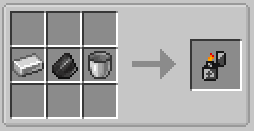

||| About
The lighter tool is used to ignite and extinguish most of the lights added by Hyper Lighting.
|||

### Crafting

||| Lighter Tool

To craft the Lighter tool, you will need:

    1x Iron Ingot
    1x Flint
    1x Bucket (Empty)

Place the above ingredients in the middle row of your crafting table in the following order from the left: Iron Ingot, Flint, Bucket (or see image above)
|||
