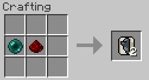

||| About
The Wireless Switch Module is used to link a Solar Fence light to a Switch Box. This allows the Switch Box to interact with the light. To link a module to a light, shift right-click on the light while holding the module.
|||

### Crafting

||| Wireless Switch Module

To craft the Wireless Switch Module, you will need:

    1x Ender Pearl
    1x Redstone Dust

Place the above ingredients in the middle row of your crafting table in the following order from the left: Ender Pearl, Redstone Dust (or see image above)
|||
