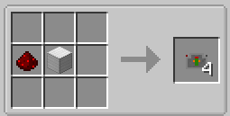

||| About
Wireless Battery modules are used to supply power to various items from the mod from solar panels. You can link multiple of these to a single panel, as long as the items they are used in doesn't draw more power than the panel can store and generate. Shift Right-Click a solar panel to bind the Wireless Battery module to that panel
|||

### Crafting

||| Wireless Battery Module

To craft the Wireless Battery Module, you will need:

    1x Redstone Dust
    1x Block of iron

Place the Redstone dust in the middle left of the crafting table and the block of iron in the center (or see the above image)
|||
