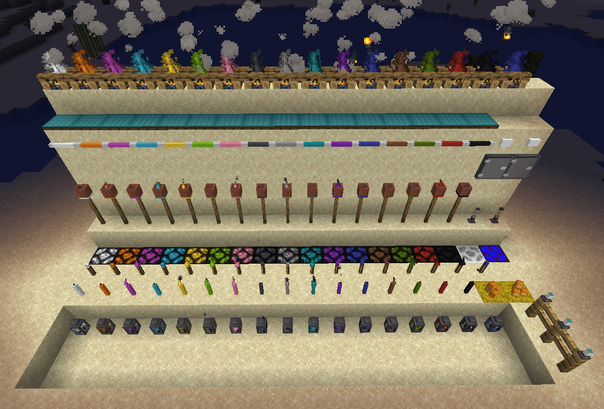

||| Information
[!badge variant="success" text="Available for Fabric"](https://www.curseforge.com/minecraft/mc-mods/hyper-lighting-fabric) [!badge Available for Forge](https://www.curseforge.com/minecraft/mc-mods/hyper-lighting)  [!badge variant="info" text="Discord"](https://discord.firstdarkdev.xyz)
|||

!!!warning
**Forge Warning**: This version of Hyper Lighting is NOT compatible with saves from the 1.12 or 1.14 version. This version is a complete rewrite and therefore requires a world where Hyper Lighting has never been. Looking for the 1.12/1.14 wiki? Find it [HERE](https://hyperlightingold.hypherionmc.me/)
!!!

||| About
Hyper Lighting adds new and sometimes useful light sources to Minecraft. It was originally created to just add a single torch to the game that could be turned on and off. It has since involved into a much bigger mod and it now even adds colored lighting to the game with the help of addon mods. The mod also includes a bit of Tech like a Solar Panel, Wireless Electricity and a Switch Board.
|||

||| Light Sources
The light sources added by this mod includes:

* [Torches](help/blocks/torches.md) that can be turned on and off (based on the Default Minecraft Torches)
* [Lanterns](help/blocks/lanterns.md) that can be turned on and off
* [Tiki Torches](help/blocks/tiki-torches.md) (cause why not)
* [Underwater Lantern/Torch](help/blocks/underwater-lighting.md) (Yes they work underwater. Why? Spongebob makes campfires underwater and you wanna ask me why??)
* [Candles](help/blocks/candles.md)
* ~~Disco Light (Because reasons)~~ -> Currently not available. May be added back in the future
* [Candle in a Jar](help/items/candle-in-jar.md) (A handheld item that emits light as you move. -> Only Available when RGBLib is installed)
* [Colored Redstone Lamps](help/blocks/redstone-lamps.md) (A colored variation of the minecraft redstone lamps)
* [Solar Powered Fence Lights](help/blocks/solar-fence.md) A Solar Powered Fence light with remote switches
* [Switch Box](help/blocks/switch-box.md) A block used to control up to 6 Solar Powered Fence Lights
* [Campfires](help/blocks/campfires.md) 2 Campfires based on the Minecraft 1.15+ campfires. Both allow you to cook food and support colored Lighting. One of them has a suprise when placed xD
* [Button lights](help/blocks/button-lights.md) Buttons that emits light. Think of them as night lights that can trigger redstone
* [Fluorescent Lights](help/blocks/flores-light.md) Battery Powered, dyeable fluorescent lights
* [Jack O Lanterns](help/blocks/jack-lantern.md) Halloween Themes Pumpkin lights
* ~~Fog Machine~~ -> Might come back soon
* [Lava Lamps](help/blocks/lava-lamp.md) (Does not actually use lava!)
* ~~Neon Signs~~ -> Removed due to complications with the GUI. This might be added back
* [Unclear glass](help/blocks/unclear-glass.md) Useful for when you want to spy on your hot neighbour without letting light in
* [Solar Panel](help/blocks/solar-panel.md) because power
* [Colored Water](help/blocks/colored-water.md) - It's colored, but you can drink it

!!!info
Almost all lights can be dyed by right-clicking them with Dye. If a light supports being dyed, it will be displayed on the tooltip. These lights also emit Colored Lighting based on their color when RGBLib (Formerly Hyper Lighting Core) is installed. [See more info here](help/integrations.md).
!!!
|||

||| Recommended, but not needed mods [!badge Forge]
Hyper Lighting has integration with some mods to make your game experience even better:
* [Cloth Config](https://www.curseforge.com/minecraft/mc-mods/cloth-config-forge) -> Allows you to access the in-game config by pressing "HOME" on your keyboard
* [Catalogue](https://www.curseforge.com/minecraft/mc-mods/catalogue) -> An Awesome mod that overhauls the MOD Menu and allows you to access the mod config when Cloth Config is installed from the main menu
* [RGBLib](https://ci.firstdarkdev.xyz/job/RGBLib/) -> The complete rewrite of Hyper Lighting Core. Allows lights to emit colored lighting. Currently only on JENKINS until mod is stable
* [The One Probe](https://www.curseforge.com/minecraft/mc-mods/the-one-probe) -> A modern, better version of HYWALA
|||

||| Recommended, but not needed mods [!badge variant="success" text="Fabric"]
Hyper Lighting has integration with some mods to make your game experience even better:
* [Cloth Config](https://www.curseforge.com/minecraft/mc-mods/cloth-config) -> Allows you to access the in-game config by pressing "HOME" on your keyboard
* [ModMenu](https://www.curseforge.com/minecraft/mc-mods/modmenu) -> Adds back the Mods button
* ~~RGBLib -> The complete rewrite of Hyper Lighting Core. Allows lights to emit colored lighting. Currently only on JENKINS until mod is stable~~ SOON!
|||

||| License
* Code -> MIT License
* Assets -> All Rights Reserved
* Modpacks -> Yes you may use this mod in your modpack
|||
